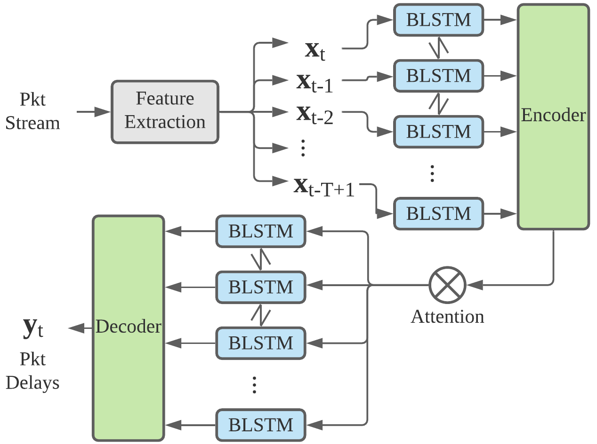
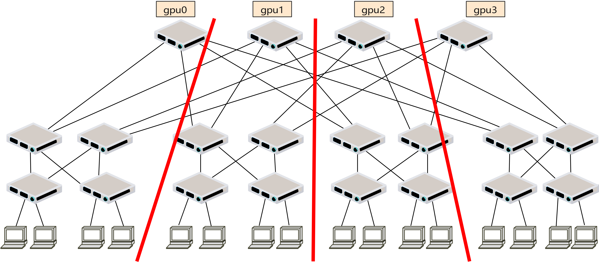
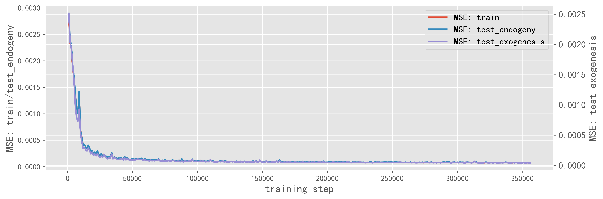
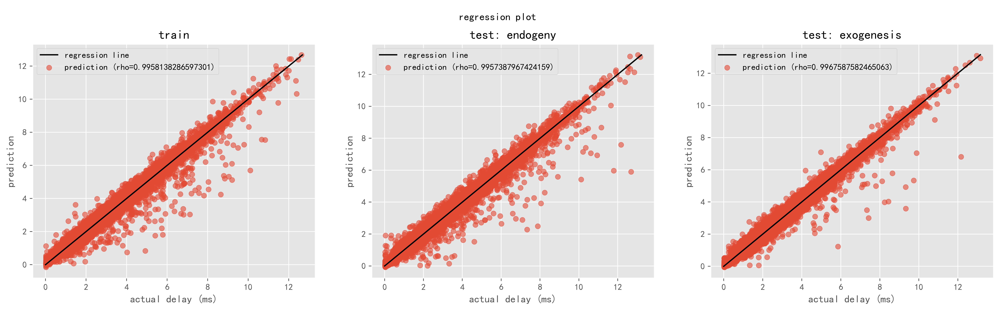
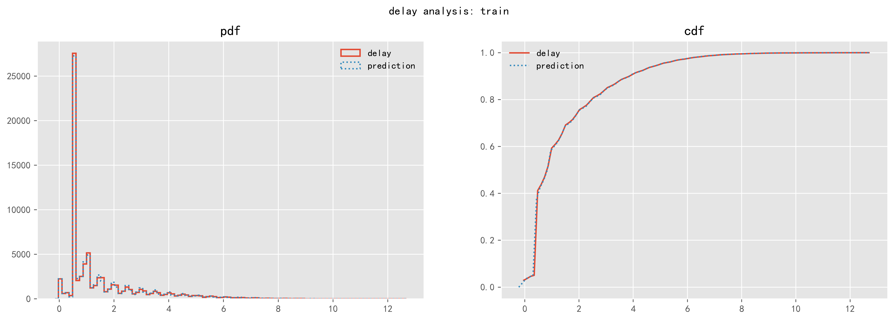
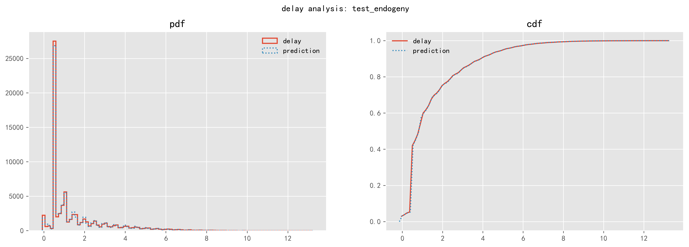
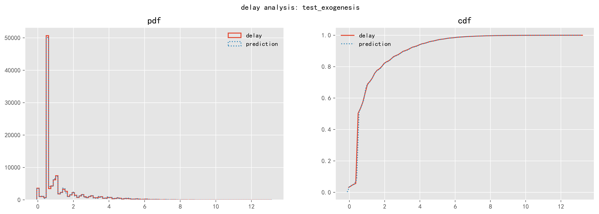

# DeepQueueNet: Towards Scalable and Generalized Network Performance Estimation with Packet-level Visibility
---

Demo paper in ACM SIGCOMM 2022


#### Abstract 
---
Network simulators are essential tools for network operators, and can assist important tasks such as capacity planning, topology design, and parameter tuning. Popular simulators are all based on discrete event simulation, and their performance does not scale with the size of modern networks. Recently, deep-learning-based techniques are introduced to solve the scalability problem, but, as we show with experiments, they have poor visibility in their simulation results, and cannot generalize to diverse scenarios. In this work, we combine scalable and generalized continuous simulation techniques with discrete event simulation to achieve high scalability, while achieving packet-level visibility. We start from a solid queueing-theoretic modelling of modern networks, and carefully identify the mathematically intractable or computationally-expensive parts, only which are then modelled using deep neural networks. Dubbed DeepQueueNet, our approach combines prior knowledge of networks, and can support arbitrary topology and device traffic management mechanisms (given sufficient training data). Our extensive experiments have shown that DeepQueueNet can achieve near-linear speed-up with the number of GPUs, and its accuracy of performance estimation is above 97.9% for average round-trip time (RTT) and 93.7% for 99th percentile RTT in all scenarios.

## Install
---
First of all, please make sure that you have at least 1 GPU on hand (16GB memory is required to run the device model). To install the right dependencies, run the following to create an environment from the `env.yml` file:
```python
conda env create -f env.yml
```
It will create a new evnvironment named `dqn_env_py36`. To activate the new environment: 
```python
conda activate dqn_env_py36 
```

To train and evaluate DeepQueueNet (`1. device model.ipynb`),  we provide some ready-to-use datasets. They are generated by a traffic generator based on the Markovian Arrival Process (MAP) and simulated with a packet-level simulator (ns.py). The trained model is saved in the `trained` folder.  Interested readers can collect some real-world traces or generate some synthetic traces from other generators to train the model.  How many traces to use depends on your requirements on its accuracy. Due to space limitations of GitHub LFS, we host the content of `data` and `trained` [on Dropbox](https://www.dropbox.com/s/q56sx4hxe93n4g5/DeepQueueNet-dataset.zip?dl=0) instead. Please download the zipped archive and extract the two folders named `data` and `trained` both to root directory before proceeding.


## Description
---
In this demo, we illustrate how to use DeepQueueNet step-by-step to make end-to-end inference on a fattree topology with input flows of different traffic patterns (traffic pattern generality):
- MAP
- Poisson process
- On-off process. 

The code of DeepQueueNet used in the demo is available on the [code_deepQueueNet](./code_deepQueueNet) directory.

The first jupyter notebook (`1. device model.ipynb`) shows how to use device-level data to train a device model.  Namely, to predict the delay distribution of a packet given the past T time steps' information when it arrives at an N-port switch:

$$
[x_{t-T+1}, x_{t-T+1}, \cdots, x_t]\stackrel{f(\cdot)}{\longrightarrow} delay.
$$

<div align="center">

</div>

All the datasets used in the first step are available on the `data/4-port switch` directory. 

After that, we present a demo to illustrate how to use the trained device model, DeepQueueNet, to make end-to-end inference on a fattree topology in the second notebook (`2. traffic gen. on fattree16.ipynb`). The task is deployed on 4 GPUs. 


<div align="center">

</div>

All the datasets used in the second step are available on the `data/fattree16` directory. 


## Performance of Device Models
---
The accuracy of device models is critical to DeepQueueNet. As an example, a device model is provided in the [trained](./trained) directory. 

The following figures show the evolution of the loss (mean square error), the prediction accuracy (Pearson correlation coefficient) and the comparison of delay distributions obtained by prediction and ground-grouth.

1. learning curve

<div align="center">

</div>

2. prediction accuracy

<div align="center">

</div>

3. delay distribution

<div align="center">

</div>
<div align="center">

</div>
<div align="center">

</div>

To make end-to-end inference on a fattree16 topology, please run `2. traffic gen. on fattree16.ipynb.`  


#### Licensing
---
Please see [LICENSE](./LICENSE.txt) for more information.
